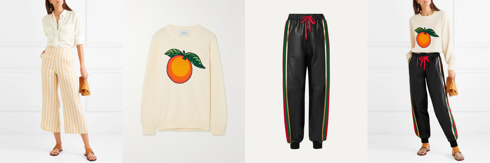
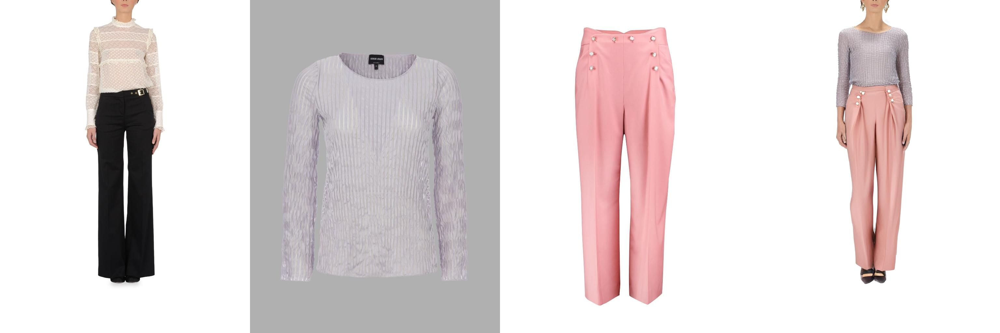

---

title: "Advancing Fine-Grained & Controllable Virtual Try-On"
# header:
#   image: /assets/img/vto-banner.jpg
---

## Multi-Garment Virtual Try-on: Enhancing IDM-VTON for Comprehensive Digital Fashion Visualization

This project presents an enhancement to IDM-VTON that enables simultaneous processing of upper and lower garments, creating a comprehensive virtual try-on system that maintains the high-fidelity detail preservation of the original architecture.

## Overview

Traditional virtual try-on systems face a critical limitation: they can only process single garments at a time. This project extends IDM-VTON's architecture to handle multiple garments simultaneously while preserving its exceptional detail fidelity.

Our approach employs:
- Vertical stacking of garment images
- Parallel CLIP processing with max pooling feature extraction
- Height-based feature concatenation
- Full-body masking strategies

## Method

### CLIP Feature Processing

A key innovation is our approach to CLIP feature processing for multiple garments:

1. Upper and lower garments are processed through CLIP independently
2. Max pooling is applied to extract salient features from each garment
3. Each garment's features are resized to match target width while maintaining pooled height
4. Features are concatenated along the height dimension

This approach preserves the distinctive characteristics of each garment while maintaining compatibility with existing network components.

### Vertical Garment Stacking

To handle multiple physical garment images through GarmentNet:

1. Upper and lower garments are vertically stacked
2. The stacked image maintains proper spatial relationships
3. Processing occurs through the existing pipeline with minimal modifications

## Results

Our implementation demonstrates strong performance across various garment combinations:

### Multi-Garment Virtual Try-On
Enhanced IDM-VTON for simultaneous processing of upper and lower garments

### Text-Guided Virtual Try-On
Implementation of text-based garment control for fine-grained attribute manipulation

## Acknowledgments

We thank Assistant Professor Xu Bingjie for supervision and guidance throughout this project.
