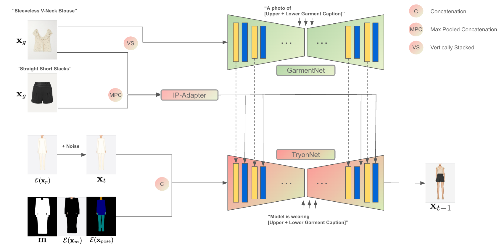
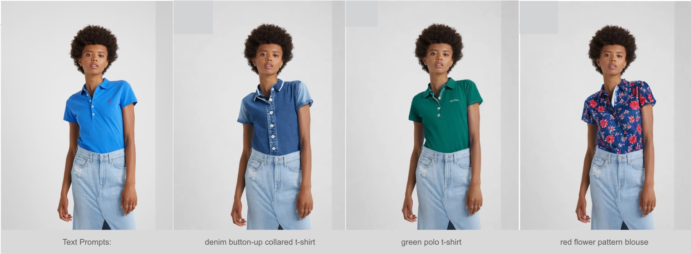

---

title: "Advancing Fine-Grained & Controllable Virtual Try-On"

---

Leshane Lee, Wu Jiakai

<h2>Abstract</h2>

This research presents two complementary advancements in virtual try-on technology that address critical limitations in current systems. The first enhances IDM-VTON to enable simultaneous processing of multiple garments while preserving intricate details. This implementation employs vertical stacking of upper and lower garment images, parallel CLIP processing with max pooling feature extraction, and height-based feature concatenation to maintain proper spatial relationships between garments. A full-body masking strategy ensures coherent outfit visualization while maintaining the detail preservation capabilities of the original architecture. The second innovation introduces text-guided garment modification capabilities by improving the EditAnything framework through sophisticated prompt engineering and ControlNet fine-tuning. This approach leverages the Segment Anything Model (SAM) for automatic clothing detection, GroundingDINO for text-image alignment, and Stable Diffusion with specialized ControlNet architecture to transform text descriptions into precise visual modifications. The implementation includes dynamic prompt enhancement, comprehensive negative prompting, and region preservation techniques that maintain image integrity during modification. Together, these technical advancements represent significant progress in addressing core challenges in virtual try-on systems: comprehensive outfit visualization and intuitive garment customization through natural language.

## Overview

Our research introduces two innovative approaches to virtual try-on technology, each addressing distinct challenges in the field:

### Multi-Garment Virtual Try-On

Extends IDM-VTON's architecture to handle multiple garments simultaneously through:

- Vertical stacking of garment images for spatial coherence
- Parallel CLIP processing with max pooling feature extraction
- Height-based feature concatenation for network compatibility
- Full-body masking strategies for comprehensive visualization

### Text-Guided Virtual Try-On

Enhances the EditAnything framework for intuitive clothing modification through:

- Automatic garment detection using SAM and GroundingDINO
- Advanced prompt engineering for precise modification control
- ControlNet fine-tuning for fashion-specific transformations
- Region preservation techniques for maintaining image integrity

## Method

### Multi-Garment Processing

The multi-garment implementation builds upon IDM-VTON's architecture with several key innovations:

**CLIP Feature Processing:**
1. Upper and lower garments are processed through CLIP independently
2. Max pooling is applied to extract salient features from each garment
3. Each garment's features are resized to match target width while maintaining pooled height
4. Features are concatenated along the height dimension

**Vertical Garment Stacking:**
1. Upper and lower garments are vertically stacked
2. The stacked image maintains proper spatial relationships
3. Processing occurs through the existing pipeline with minimal modifications

### Text-Guided Modification

The text-guided virtual try-on system follows a multi-stage process:

**Input Processing:**
1. Natural language description of desired garment modifications
2. Image with the target garment to be modified

**Automatic Region Detection:**
1. GroundingDINO processes both input image and text description
2. SAM performs pixel-level segmentation of the target clothing area

**Modification Generation:**
1. Dynamic prompt enhancement with fashion-specific attributes
2. Fine-tuned ControlNet guidance for structural integrity
3. Region preservation techniques for maintaining non-target areas

## Results

### Multi-Garment Virtual Try-On

Our implementation demonstrates strong performance across various garment combinations:

### Text-Guided Virtual Try-On

The text-guided approach shows impressive capabilities in modifying garments based on natural language descriptions:

## Team

**Jiakai Wu** - Multi-Garment Virtual Try-On

- Implemented vertical stacking architecture
- Developed parallel CLIP processing with max pooling
- Created full-body masking strategies
- Enhanced IDM-VTON for multi-garment processing

**Leshane Lee** - Text-Guided Virtual Try-On

- Developed dynamic prompt engineering techniques
- Implemented specific garment masking with SAM and GroundingDINO
- Fine-tuned ControlNet for fashion-specific applications
- Enhanced EditAnything framework for garment modifications

## Academic Purpose

This work was conducted solely for academic and research purposes as part of a university capstone project. The implementations and adaptations presented here aim to explore and advance virtual try-on technology from an educational perspective, contributing to the academic discourse in this field. Neither implementation is intended for commercial deployment, and both serve primarily as technical demonstrations of what's possible within the current technological framework. Our goal is to share knowledge, foster further research, and provide learning opportunities for students and researchers interested in computer vision, machine learning, and fashion technology applications.

## References

**Foundational Projects:**
- IDM-VTON: [github.com/yisol/IDM-VTON](https://github.com/yisol/IDM-VTON)
- EditAnything: [github.com/sail-sg/EditAnything](https://github.com/sail-sg/EditAnything)

**Key Technologies:**
- Segment Anything Model (SAM)
- Stable Diffusion XL Inpainting
- ControlNet Architecture
- CLIP ViT-H/14
- IP-Adapter

All credit for the original implementations goes to their respective authors and developers. Our work builds upon these foundation models and would not be possible without their pioneering contributions to the field. We express our sincere gratitude to the research teams behind these technologies for making their work available to the academic community.

## Acknowledgments

We extend our deepest gratitude to Assistant Professor Xu Bingjie for her exceptional guidance, technical insights, and unwavering support throughout this project. Her expertise in computer vision and machine learning significantly shaped our approach and implementation strategies. Professor Xu's patient mentorship, thoughtful feedback, and encouragement to explore innovative solutions were instrumental in helping us overcome technical challenges and achieve our research objectives. We are particularly thankful for her dedication in providing timely reviews of our progress and for creating an environment that fostered both academic rigor and creative exploration.

